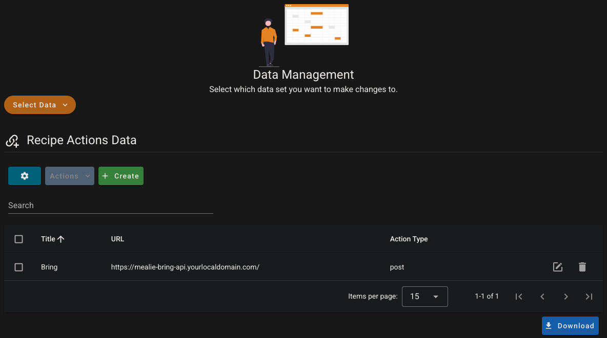

# Mealie Bring API Integration

The self-hosted recipe manager [Mealie](https://github.com/mealie-recipes/mealie) startet to support sending a recipe to a Bring shopping list with this [PR](https://github.com/mealie-recipes/mealie/pull/3448). However, this requires the Mealie instance to be publicly available (from the internet). Since many users want their self-hosted services to **not** be available from the internet, I chose to create this integration.

This project provides a simple webserver which offers two main actions:
1. Adding ingredients from a Mealie recipe to a specified Bring shopping list
2. Moving all ingredients from a Mealie shopping list to a specified Bring shopping list (optional)

If you like the project, please consider giving it a star on GitHub, thank you very much! ⭐

## Architecture

### Without this project

1. The `Mealie instance` sends a `GET` request to the recipe to `API of bring`
   (See [Bring API docs](https://sites.google.com/getbring.com/bring-import-dev-guide/web-to-app-integration)).
	- The link looks like
	  this `https://api.getbring.com/rest/bringrecipes/deeplink?url=<mealieinstance>g/home/r/<recipe>&source=web`.
2. `Bring` then does a `GET` request to the `Mealie instance` and pulls the ingredients.
	- In order for this to work the `Mealie instance` has to be reachable from the public internet.
	- This opens an attack vector as anyone can access the `Mealie instance`.

### With this project

#### Action 1: Adding ingredients from a recipe to Bring

1. The `client` (e.g. your phone or PC) sends a `POST` request to the `Mealie instance` instructing it to trigger the adding of the ingredients.
2. The `Mealie instance` sends a `POST` request to this `webserver` at the endpoint `/` with the ingredients in its body. An example for such a request can be found in the [tests](test/conftest.py).
3. The `webserver` extracts the ingredients from the request and adds them directly to a list of the users choice via the [`Bring API`](https://github.com/miaucl/bring-api).

#### Action 2: Moving ingredients from a shopping list to Bring (optional)

1. The `client` (e.g. your phone or PC) sends a `POST` request to this `webserver` at the endpoint `/move-ingredients-from-shopping-list`.
2. The `webserver` connects to the `Mealie instance` using the provided API key, retrieves all items from the specified shopping list, and removes them from the Mealie shopping list.
3. The `webserver` adds these items to the specified Bring shopping list via the [`Bring API`](https://github.com/miaucl/bring-api) and removes them from shopping list in Mealie.

This integration runs entirely local and does **not** require any service to be exposed to the Internet.

## Deployment

Deployment can be done in three simple steps:
1. Figure out the environment variables you want/need to set
2. Choose a deployment option
3. Configure Mealie

### Environment variables

No matter which deployment option you chose, you must set up some environment variables:

| Variable name               | Description                                                                                                                                                                                                    | Required | Default   | Example                            | Required for Action |
|-----------------------------|----------------------------------------------------------------------------------------------------------------------------------------------------------------------------------------------------------------|:--------:|-----------|------------------------------------|---------------------|
| `BRING_USERNAME`            | The email address of your bring account                                                                                                                                                                        |   Yes    | -         | `myuser@myemailprovider.com`       | 1, 2                |
| `BRING_PASSWORD`            | The password of your bring account                                                                                                                                                                             |   Yes    | -         | `my super secret password`         | 1, 2                |
| `BRING_LIST_NAME`           | The exact name of the list you want to add the ingredients to, supports special characters                                                                                                                     |   Yes    | -         | `My shopping list with spaces`     | 1, 2                |
| `MEALIE_BASE_URL`           | The base URL of your Mealie instance (e.g. `http://mealie:9000` or `https://mealie.yourdomain.com`)                                                                                                            |    No    | -         | `http://mealie:9000`               | 2                   |
| `MEALIE_API_KEY`            | The API key for your Mealie instance. Can be generated in Mealie under `https://mealie.yourdomain.com/user/profile/api-tokens`                                                                                 |    No    | -         | `mealie_api_key_123456`            | 2                   |
| `MEALIE_SHOPPING_LIST_UUID` | The UUID of the shopping list you want to pull items from. If not specified, items from all shopping lists will be pulled                                                                                      |    No    | -         | `12345678-1234-1234-1234-12345678` | 2                   |
| `LOG_LEVEL`                 | The loglevel the application logs at                                                                                                                                                                           |    No    | `INFO`    | `DEBUG`                            | 1, 2                |
| `HTTP_HOST`                 | The address the application tries to attach to, leave this empty to listen on all interfaces, leave this empty if you are using Docker                                                                         |    No    | `0.0.0.0` | `192.168.1.5`                      | 1, 2                |
| `HTTP_PORT`                 | The port the application listens on, change this if needed if you run the application locally, leave this empty if you are using Docker                                                                        |    No    | `8742`    | `1234`                             | 1, 2                |
| `HTTP_BASE_PATH`            | The path the application listens on. Use this if you use the app behind a reverse proxy and have setup a path (e.g. set this to `/bring` if the application shall listen on `<mealie>.<yourdomain>.tld/bring`) |    No    | `""`      | `/bring`                           | 1, 2                |

Ensure to quote your environment variables. Without quotes your password might not be read properly if it contains symbols such as `<`, `&` or `;`.


#### Ignoring ingredients

It is possible to define ingredients that shall never be added to the shopping list. These are ingredients you always have at home (e.g., salt and pepper).

To do so
1. Open the `Data Management` (under `<your mealie domain>/group/data/foods/`).
2. Search for the ingredient you don't want to be added to the shopping list.
3. Click on the edit button.
4. Enable the checkbox `On Hand`.

   

### Deployment options

You can run this app in three simple ways. I prefer the third option. Depending on the deployment option you chose
you can ignore some environment variables (e.g. `HTTP_HOST` and `HTTP_PORT`).

#### 1. Locally

1. Copy the contents `./assets/env.example` to `./.env` and adjust the environment variables to your needs.
2. Install the requirements with `poetry install`.
3. Run `python source/main.py`.

#### 2. As a container with `docker run`

1. Run `docker run mealie-api` and pass in your environment variables with `-e`.
	- You *can* (not must) specify a different port than the default (`8742`) with `-p 1234:8742`.
	- Example:
	   ```bash
	   docker run \
	       -e BRING_USERNAME="myuser@myemailprovider.com" \
	       -e BRING_PASSWORD="my super secret password" \
	       -e BRING_LIST_NAME="My shopping list with spaces" \
	       -p 1234:8742 \
	       ghcr.io/felixschndr/mealie-bring-api:latest
	   ```

#### 3. As a container with `docker-compose` (Preferred way)

1. Add this container to your existing docker-compose next to your Mealie instance or create a new docker-compose
   and adjust the environment variables to your needs.
   Take a look at the [example docker-compose](./assets/docker-compose-example.yml).
2. Run `docker-compose up`.

### Setup in Mealie

After deploying the container, you need to set up the actions you want to use.

#### Action 1: Adding ingredients from a recipe to Bring

1. Head over to `http(s)://<your-mealie-instance>/group/data/recipe-actions` (e.g., 
`http://localhost:1234/group/data/recipe-actions`) while being logged in as an administrator.

   
2. Click on `Create` to create a new `action`.
3. Give it any title (e.g. `Bring` or `Add ingredients to Bring`). This will be visible for the users.

   
4. For the `URL` input the address where this project is running on followed by a `/` (e.g. `http://<ip-of-server>:8742/` or `https://mealie-bring-api.yourlocaldomain.com/` if you are using a reverse proxy)
5. Change the `Type` to `POST`
6. Save

   
7. Try it out 🎉

#### Action 2: Moving ingredients from a shopping list to Bring (optional)

If you don't want to use this action, you can skip this entirely.
If you want to use this action, you need to:

1. Generate an API key in Mealie:
   - Go to your profile in Mealie
   - Navigate to the "API Keys" section (e.g. `https://mealie.yourdomain.com/user/profile/api-tokens`)
   - Create a new API key with an appropriate name (e.g., "Bring Integration")
   - Copy the generated key
2. Set the required environment variables:
   - `MEALIE_BASE_URL`: The base URL of your Mealie instance
   - `MEALIE_API_KEY`: The API key you just generated
   - `MEALIE_SHOPPING_LIST_UUID` (optional): If you want to pull items from a specific shopping list only. The items of all shopping lists will be pulled if this is empty.
3. Add a new action the same way as `Action 1` is added, but set the path to `/move-ingredients-from-shopping-list` (
   e.g. `http://<ip-of-server>:8742/move-ingredients-from-shopping-list` or `https://mealie-bring-api.yourlocaldomain.com/move-ingredients-from-shopping-list` if you are using a reverse
   proxy)
4. Try it out 🎉

### Usage

#### Action 1: Adding ingredients from a recipe to Bring

1. Head over to a recipe of your choice in Mealie.
2. Click on the three little dots.
3. Click on `Recipe Actions`
4. Choose your new action (e.g. `Bring`)

   
5. That's it!
   - You should now see the ingredients in your list
   - You should see some output in the logfile
      ```text
      [2025-07-28 15:23:11,785] [BringHandler] [INFO] Attempting the login into Bring
      [2025-07-28 15:23:12,589] [BringHandler] [INFO] Login successful
      [2025-07-28 15:23:12,729] [BringHandler] [INFO] Found the list with the name "My List" (UUID: 12345678-1234-1234-1234-12345678)

      [2025-07-28 15:24:33,872] [Main] [INFO] Received recipe "Apfelstrudel" from "1.2.3.4"
      [2025-07-28 15:24:33,873] [Main] [INFO] Adding ingredients to Bring: [Ingredient(name='Butter', specification='60 Gramm'), Ingredient(name='Semmelbrösel', specification='80 Gramm (oder Mandelsplitter)'), Ingredient(name='Mandelsplitter', specification='80 Gramm'), Ingredient(name='Zitronensaft', specification='30 Milliliter'), Ingredient(name='Zucker', specification='80 Gramm'), Ingredient(name='Zimt', specification='1 Teelöffel'), Ingredient(name='Apfel', specification='1 Kilogramm'), Ingredient(name='Rosinen', specification='150 Gramm')]
      ```

#### Action 2: Moving ingredients from a shopping list to Bring

1. Add the items of your recipes to your Mealie shopping list or add items manually.

   
2. After you add all the items, you want to move to Bring open _any_ recipe
3. Click on `Recipe Actions`
4. Choose your new action (e.g. `Move items to Bring`)

   
5. That's it!
   - The items will be removed from your Mealie shopping list and added to your Bring shopping list.
   - You should see some output in the logfile
   ```text
   [2025-07-28 16:45:21,123] [MealieHandler] [INFO] Connection to Mealie successful

   [2025-07-28 16:45:23,012] [Main] [INFO] Moving ingredients from shopping list to Bring
   [2025-07-28 16:45:23,345] [MealieHandler] [INFO] Filtering for shopping list with UUID aa3632b1-b51e-4a3c-914e-5c703fa5c15a
   [2025-07-28 16:45:24,012] [MealieHandler] [DEBUG] Deleting 3 items from shopping list
   [2025-07-28 16:45:24,345] [[Main] [INFO] Adding ingredients to Bring: [Ingredient(name='Butter', specification='60 Gramm'), Ingredient(name='Semmelbrösel', specification='80 Gramm (oder Mandelsplitter)'), Ingredient(name='Mandelsplitter', specification='80 Gramm'), Ingredient(name='Zitronensaft', specification='30 Milliliter'), Ingredient(name='Zucker', specification='80 Gramm'), Ingredient(name='Zimt', specification='1 Teelöffel'), Ingredient(name='Apfel', specification='1 Kilogramm'), Ingredient(name='Rosinen', specification='150 Gramm')]
   ```

## Maintenance

You can check whether the webserver is still alive by sending a `GET` request to `/status` and check if you get a `200` 
status code:
```bash
$ curl -I https://mealie-bring-api.yourlocaldomain.com/status
HTTP/2 200
server: openresty
date: Mon, 20 May 2024 12:27:56 GMT
content-type: text/html; charset=utf-8
content-length: 2
strict-transport-security: max-age=63072000; preload
```
or
```bash
$ curl -s -o /dev/null -w "%{http_code}" https://mealie-bring-api.yourlocaldomain.com/status
200
```
