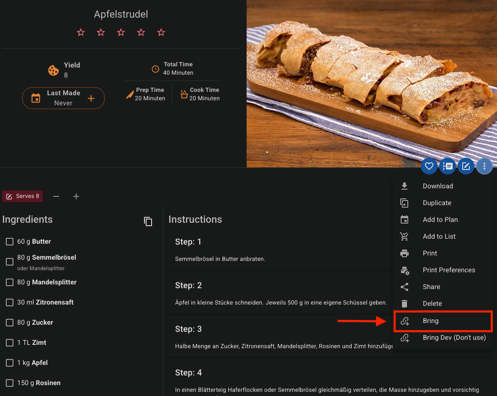

# Mealie Bring API Integration

The self-hosted recipe manager [Mealie](https://github.com/mealie-recipes/mealie) startet to support sending a recipe to
a Bring shopping list with this [PR](https://github.com/mealie-recipes/mealie/pull/3448). However, this requires the
Mealie instance to be publicly available (from the internet). Since many users want their self-hosted services to
*not* be available from the internet, I chose to create this integration.

This project provides the source code and a container image for a simple webserver which listens for requests by the 
Mealie instance and adds the ingredients of a recipe to a specified Bring shopping list.

## Architecture

### Without this project

1. The `Mealie instance` sends a `GET` request to the recipe to `API of bring`
   (See [Bring API docs](https://sites.google.com/getbring.com/bring-import-dev-guide/web-to-app-integration)).
	- The link looks like
	  this `https://api.getbring.com/rest/bringrecipes/deeplink?url=<mealieinstance>g/home/r/<recipe>&source=web`.
2. `Bring` then does a `GET` request to the `Mealie instance` and pulls the ingredients.
	- In order for this to work the `Mealie instance` has to be reachable from the public internet.
	- This opens an attack vector as anyone can access the `Mealie instance`.

### With this project

1. The `Mealie instance` sends a `POST` request to this `webserver` with the ingredients in its body.
2. The `webserver` extracts the ingredients from the request and adds them directly to a list of the users choice via
   the `Bring API`.

## Deployment

### Environment variables

No matter which deployment option you chose you must setup some environment variables:

| Variable name         | Description                                                                                                                             | Required | Default                           | Example                      |
|-----------------------|-----------------------------------------------------------------------------------------------------------------------------------------|:--------:|-----------------------------------|------------------------------|
| `BRING_USERNAME`      | The email address of your bring account                                                                                                 |   Yes    | -                                 | myuser@myemailprovider.com   |
| `BRING_PASSWORD`      | The password of your bring account                                                                                                      |   Yes    | -                                 | my super secret password     |
| `BRING_LIST_NAME`     | The exact name of the list you want to add the ingredients to, supports special characters                                              |   Yes    | -                                 | My shopping list with spaces |
| `IGNORED_INGREDIENTS` | Ingredients that are never added to the shopping list (things you always have at home), separated by a `,`, case insensitive            |    No    | - (all ingredients will be added) | Salt,Pepper,Frying oil       |
| `LOG_LEVEL`           | The loglevel the application logs at                                                                                                    |    No    | `INFO`                            | `DEBUG`                      |
| `HTTP_HOST`           | The address the application tries to attach to, leave this empty to listen on all interfaces, leave this empty if you are using Docker  |    No    | `0.0.0.0`                         | `192.168.1.5`                |
| `HTTP_PORT`           | The port the application listens on, change this if needed if you run the application locally, leave this empty if you are using Docker |    No    | `8742`                            | `1234`                       |

### Deployment options

You can run this app in three simple ways. I prefer the third option. Depending on the deployment option you chose
you can ignore some environment variables (e.g. `HTTP_HOST` and `HTTP_PORT`).

#### 1. Locally

1. Copy the contents `./assets/env.example` to `./.env` and adjust the environment variables to your needs.
2. (Optional) Create and activate a virtual environment with `python -m venv .venv; source .venv/bin/activate`.
3. Install the requirements with `pip install -r ./assets/requirements.txt`.
4. Run `python source/main.py`.

#### 2. As a container with `docker run`

1. Run `docker run mealie-api` and pass in your environment variables with `-e`.
	- You *can* (not must) specify a different port than the default (`8742`) with `-p 1234:8742`.
	- Example:
	   ```bash
	   docker run 
	       -e BRING_USERNAME="<your email>"
	       -e BRING_PASSWORD="<your password>"
	       -e BRING_LIST_NAME="<your list name>"
	       -p 1234:8742
	       ghrc.io/felixschndr/mealie-bring-api:latest
	   ```

#### 3. As a container with `docker-compose` (Preferred way)

1. Add this container to your existing docker-compose next to your Mealie instance or create a new docker-compose
   and adjust the environment variables to your needs.
   Take a look at the [example docker-compose](./assets/docker-compose-example.yml).
2. Run `docker-compose up`.

### Setup in Mealie

After deploying the container, there is one simple step you have to do in Mealie: You have to set up the link between 
Mealie and this project.

1. Head over to `http(s)://<your-mealie-instance>/group/data/recipe-actions` (e.g., 
`http://localhost:1234/group/data/recipe-actions`) while being logged in as an administrator.

   
2. Click on `Create` to create a new `action`.
3. Give it any title (e.g. `Bring` or `Add ingredients to Bring`). This will be visible for the users.

   
4. For the `URL` input the address where this project is running on followed by a `/` (e.g. `http://localhost:8742/` 
   or `https://mealie-bring-api.yourlocaldomain.com/` if you are using a reverse proxy)
5. Change the `Type` to `POST`
6. Save

   
7. Try it out 🎉

### Usage in Mealie

1. Head over to a recipe of your choice.
2. Click on the three little dots.
3. Click on `Recipe Actions`
4. Chose your new action (e.g. `Bring`)

   
5. That's it!
   - You should now see the ingredients in your list
   - You should see some output in the logfile
   ```text
   mealie_bring_api | [2024-05-18 13:38:41,090] [LoggerMixin] [INFO] [Received recipe Apfelstrudel from https://mealie-bring-api.yourlocaldomain.com]
   mealie_bring_api | [2024-05-18 13:38:45,373] [LoggerMixin] [INFO] [Added all ingredients to Bring]
   ```

## Maintenance

You can check whether the webserver is still alive by sending a `GET` request to `/status` and check if you get a `200` 
status code:
```bash
$ curl -I https://mealie-bring-api.yourlocaldomain.com/status
HTTP/2 200
server: openresty
date: Mon, 20 May 2024 12:27:56 GMT
content-type: text/html; charset=utf-8
content-length: 2
strict-transport-security: max-age=63072000; preload
```
or
```bash
$ curl -s -o /dev/null -w "%{http_code}" https://mealie-bring-api.yourlocaldomain.com/status
200
```
